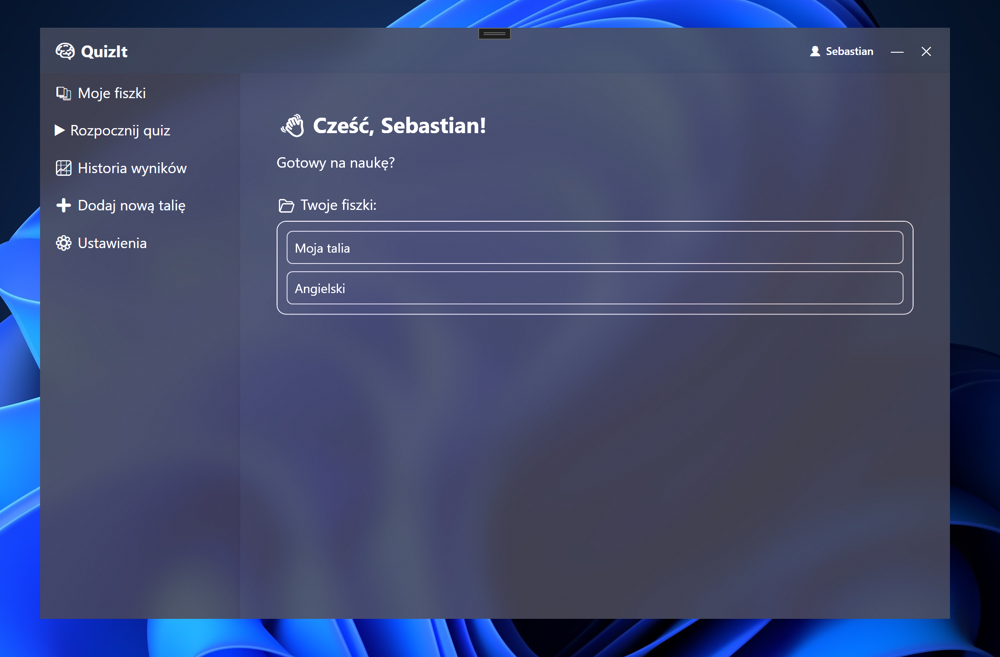

# QuizIt 🧠  
QuizIt is a modern WPF-based flashcard learning app that allows users to create, manage, and study from decks of flashcards. It supports text and multiple choice questions, statistics tracking, and a built-in quiz engine.



## ✨ Features

- 🗂️ Deck and flashcard management (create, edit, delete)
- 📝 Support for both text-based and multiple choice questions
- 🎓 Quiz mode with instant feedback
- 📊 Detailed statistics and quiz history
- 🎨 Light/Dark theme support
- 💾 Data persistence using SQLite and EF Core
- 🧠 Personalized greeting and smooth UX

## 🚀 Technologies

- .NET 6 / C# WPF
- Entity Framework Core (EF Core)
- MVVM Architecture
- SQLite
- LiveCharts
- EF Core (SQLite)
- XAML Resource Dictionaries for themes

## 🗃️ Database

The application uses **SQLite** as a lightweight embedded database. All data such as decks, flashcards, questions, quiz results, and statistics are stored locally.

- The database is initialized automatically on application startup using `AppDbContext` and the static method `DbInitializer.Initialize()`.
- The default SQLite file is created in the app's local folder under the name:  
  ```
  quizit.db
  ```
- All database operations are performed using **Entity Framework Core** (EF Core).
- Relations:
  - `Deck` → contains many `Flashcards`
  - `Flashcard` → contains many `FlashcardQuestions`
  - `FlashcardQuestion` → may contain either text or multiple-choice data
  - `QuizResult` → stores results of completed quizzes

You don't need to configure anything manually – just build and run the app!

## ▶ Getting Started

1. Clone the repository:
   ```bash
   git clone https://github.com/Fablek/quizit.git
   ```
2. Open the solution in Visual Studio
3. Build and run the app – the database will be created automatically
